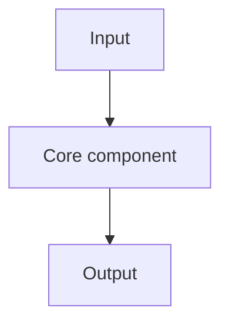

# [System Or Library] [Component] Code Walkthrough

## Introduction

[Explain what component is being studied and why it matters.]

## Intuition

[Describe the component before reading code.]

## Scope

- Repository: [repo link]
- Version or commit: [commit/tag]
- Files: [important paths]

## How It Works

1. [Step 1]
2. [Step 2]
3. [Step 3]

## Key Code Path

[Walk through the important functions in execution order.]

## Complexity

### Time Complexity

[Main runtime cost.]

### Space Complexity

[Main memory cost.]

## Design Tradeoffs

| Decision | Alternative | Tradeoff |
| --- | --- | --- |
| [Decision] | [Alternative] | [Tradeoff] |

## Key Takeaways

- [Takeaway 1]
- [Takeaway 2]

## References

- [Stable code link]

