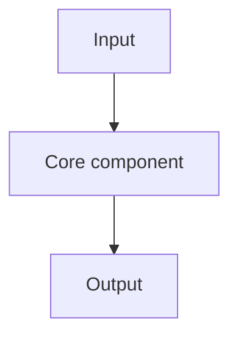

# [System Or Library] [Component] Code Walkthrough

## Motivation

[What implementation question does this walkthrough answer?]

## Scope

- Repository: [repo link]
- Version or commit: [commit/tag]
- Files: [important paths]

## Concept Frame

[Explain the concept before reading code.]

## Execution Path

[Describe the high-level flow before line-level details.]

## Key Code Path

[Walk through the important functions in execution order.]

## Design Decisions

| Decision | Alternative | Tradeoff |
| --- | --- | --- |
| [Decision] | [Alternative] | [Tradeoff] |

## Failure Modes

- [Failure mode 1]
- [Failure mode 2]

## Takeaways

- [Takeaway 1]
- [Takeaway 2]

## References

- [Stable code link]

