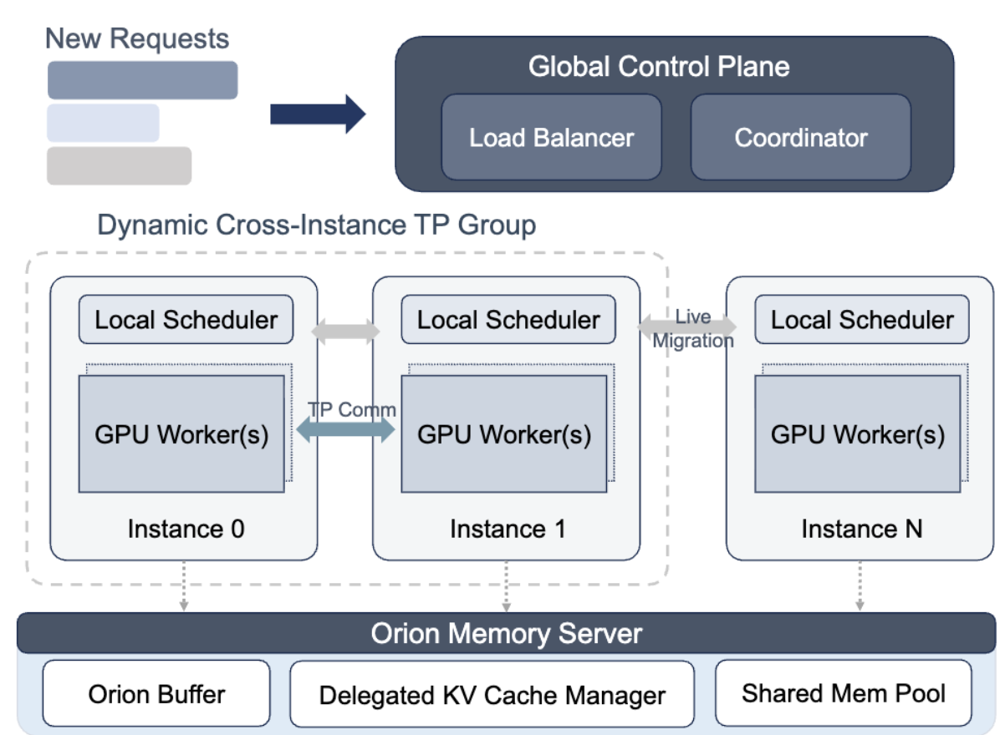

# OrionInfer: Low-Overhead Parallelism Switching and Live Migration for Efficient LLM Serving

## Metadata
- Paper: OrionInfer: Low-Overhead Parallelism Switching and Live Migration for Efficient LLM Serving
- Authors: Jingqi Feng, Guang Yang, Yukai Huang, Sicheng Liang, et al.
- Year: 2026
- Venue: KDD '26
- DOI: 10.1145/3770855.3817626
- Link: https://dl.acm.org/doi/epdf/10.1145/3770855.3817626
- Area: LLM serving, inference systems, parallelism switching, live migration
- Status: unread


## One-Sentence Summary
This paper presents an adaptive LLM serving systems that aligns inference strategies with real time demand. This is done through the following strategies:
1) Runtime switching between data parallelism and tensor parallelism with negligible overhead
2) An efficient inference pipeline that preserves batching efficiency during parallelism transitions
3) Live-migration based load balancing to alleviate memory pressure and imrpove resource utilization


## Problem
TP-priority setup suffers from hardware underutilization duringbursts, while a DP-priority setup fails to meet the latency require-ments of long-context requests. This rigidity in existing systemssuggests that a one-size-fits-all parallelism is inherently unable tomaintain optimal performance across fluctuating traffic patterns

## Core Idea and background
LLM inference consists of two phases:
1) Prefill phase, where it process the entire input prompt in parallel to generate the first token. This is measured by Time-To-First-Token (TTFT)
2) Decoding phase, subsequent tokens are generated one by one, generally memory bounded. Since each step only processes a single token per request, the hardware computational power is often underutilized. Performance is measured by Time-Per-Output-Token (TPOT) 
Works have been done in this space to improve inference optimization. One such example is to have parallelism strategies and dynamic adaptation. To handle large scale LLM serving capacity, systems use **static** (this paper aims to prove that a dynamic approach is better) Tensor Parallalism and Data Parallalism to improve serving capacity. Tensor Parallalism reduces latency for individual requests by **splitting large computations across multiple GPUs**. Data Parallalism maintains **higher preak throughput by processing multiple requests in parallel across different model replicas, making it more efficient for high traffic cases. 

## How It Works

1) Global Control Plane. 
    - Load Balancer: Distributes new requests. Employs a dual-mode distribution strategy based on real time memory pressure of the cluster. **Throughput Oriented Mode** is activated when the overall KV Cache utilization is low, to max throughput. **Memory Aware Mode** is triggered as KV Cache reaches a threshold. IT shifts to a memory aware strategy, routing requests to instances with the most available KV slots. This maintains service stability even when the cluster is near its memory limit. 
    - **Coordinator:** Tracks snapshots of all instances and makes high-level decisions, such as triggering parallelism hot switching or initiating live migration when a specific instance becomes overloaded. It dynamically chooses between two execution strategies:
    - **Low-Latency TP Mode:** Optimizes individual request latency. When traffic is low, multiple GPU instances cooperate on the **prefill of a single request** using Cross-Instance Tensor Parallelism (TP), reducing Time-To-First-Token (TTFT).

    - During Cross-Instance TP, OrionInfer chooses one of the participating instances as the **Head Instance**.
    - All participating GPU instances cooperate to perform the compute-heavy **prefill**, but OrionInfer does not want all of these instances to remain tied together during decoding.
    - This is because decoding is less compute-heavy and does not benefit as much from using multiple instances for the same request.
    - Therefore, after prefill, the request will return to normal **DP mode**, where a single instance independently performs decoding.

    - **Problem:** During TP prefill, the generated KV Cache is distributed across the participating TP workers. However, the Head Instance needs the KV Cache required to independently continue the request during decoding.

    ```text
    CROSS-INSTANCE TP PREFILL

                        Request A
                            ↓
                  ┌─────────┼─────────┐
                  ↓         ↓         ↓
                GPU 0     GPU 1     GPU 2
                (HEAD)
                  ↓         ↓         ↓
              KV Shard   KV Shard   KV Shard
                  \         |         /
                   \        |        /
                    └───────┼───────┘
                            ↓
                  Gather KV to Head
                            ↓

    ------------------------------------------------

    DP DECODING

                       GPU 0 (HEAD)
                            ↓
                     Full KV Cache
                            ↓
                     Generate Token
                            ↓
                     Generate Token
                            ↓
                           ...
    ```

    - **Naive approach:** Wait until TP prefill finishes and then transfer all generated KV Cache data to the Head Instance.
        - This would introduce a large communication delay between prefill and decoding.
        - Some of the latency improvement gained from using TP for prefill would therefore be lost.

    - **OrionInfer's solution: overlap KV gathering with prefill computation.**
        - As each Transformer layer performs attention and generates new KV tensors, OrionInfer asynchronously sends these KV tensors to the **Orion Buffer**.
        - The Orion Memory Server then gathers the KV tensors into the Head Instance while the GPUs continue computing subsequent layers.
        - Therefore, **KV transfer and prefill computation happen at the same time**.

    ```text
    PREFILL COMPUTATION                  KV GATHERING

    Layer 1 computes KV ───────────────→ Head Instance
            ↓
    Layer 2 computes KV ───────────────→ Head Instance
            ↓
    Layer 3 computes KV ───────────────→ Head Instance
            ↓
           ...

             Computation and KV transfer overlap
                            ↓
                    Prefill completes
                            ↓
                Head already has KV Cache
                            ↓
                    Switch back to DP
                            ↓
                  Independent decoding
    ```

    - **Key intuition:** Multiple instances are temporarily borrowed to accelerate the compute-heavy prefill. Meanwhile, the KV Cache they generate is asynchronously gathered to one **Head Instance**. Once prefill finishes, the other instances can leave the TP group, while the Head Instance continues decoding the request independently.

    - **Throughput-Oriented DP Mode:** Optimizes system-wide throughput. When traffic is high, each GPU instance independently processes different requests, allowing more requests to be processed in parallel and clearing the queue faster.
    - **Key intuition:** Prefill is compute-bound, so combining the compute power of multiple GPUs using TP can significantly reduce TTFT. Decoding is more memory-bound and less compute-heavy, so it is generally not worth using multiple instances for one request.  


- To switch between DP and TP has its challenges:
    1. **Synchronization Overhead**
        - To overcome this, OrionInfer creates a collective communication group among all local schedulers.
        - Local schedulers participate in a lightweight negotiation to decide whether to form a Cross-Instance TP batch based on the Coordinator's instructions.
        - Once a transition is triggered, the instances synchronize critical states, including available KV pages and request allocations, to ensure a consistent execution boundary for the Cross-Instance TP phase.

        2. **Weight Reconfiguration and KV Cache Layout Incompatibility**

        - The weight and KV Cache layouts required by **DP** and **TP** are different.

        - In **DP mode**, each GPU instance is an independent replica and initially holds a **complete copy of the model weights**.

        ```text
        DP MODE

        GPU 0                       GPU 1
        ┌─────────────────┐         ┌─────────────────┐
        │   Full Model    │         │   Full Model    │
        │    Weights      │         │    Weights      │
        └─────────────────┘         └─────────────────┘
                ↓                           ↓
            Request A                   Request B

        Each instance can independently process a different request.
        ```

        - In **TP mode**, multiple GPUs cooperate to process the **same request**. The model computation is partitioned across the TP workers.

        ```text
        TP MODE

                           Request A
                               ↓
                      Model Computation
                     /                 \
                    ↓                   ↓
                GPU 0                 GPU 1
           ┌──────────────┐      ┌──────────────┐
           │ Weight Shard │      │ Weight Shard │
           │      W0      │      │      W1      │
           └──────────────┘      └──────────────┘
                    \                   /
                     \                 /
                      ↓               ↓
                       TP Communication

        Multiple GPUs cooperate on the SAME request.
        ```

        - **Problem when switching DP → TP:** In DP, both GPUs contain the complete model, whereas TP requires each worker to operate on the weight shard associated with its TP rank.

        ```text
        BEFORE: DP

        GPU 0                    GPU 1
        [ Full Model W ]         [ Full Model W ]

                  ↓ Hot Switch: DP → TP ↓

        AFTER: TP

        GPU 0                    GPU 1
        [ Shard W0 ]  ← TP →    [ Shard W1 ]
                \                    /
                 \                  /
                    Same Request
        ```

        - Since every instance already contains a complete copy of the model, OrionInfer does not need to transfer the model weights between instances.

        - Instead, OrionInfer performs **virtual sharding** based on the worker's **flattened rank within the TP group**.

        - Intuition:
            - GPU 0 → TP rank 0 → use shard W0
            - GPU 1 → TP rank 1 → use shard W1
            - GPU 2 → TP rank 2 → use shard W2

        - This avoids physically redistributing the model weights whenever OrionInfer switches from DP to Cross-Instance TP.

        - **KV Cache Layout Incompatibility**
            - A similar problem occurs with the **KV Cache**.
            - In DP mode, each instance manages its own physical PagedAttention KV Cache independently.
            - When multiple independent DP instances are temporarily combined into a **Cross-Instance TP group**, their existing KV Cache layouts do not naturally form the unified layout expected by TP.
            - Physically moving/reorganizing all the KV Cache whenever the system switches modes would introduce significant overhead.

        ```text
        BEFORE: Independent DP Instances

        Instance 0                  Instance 1
        ┌─────────────────┐         ┌─────────────────┐
        │ Local KV Cache  │         │ Local KV Cache  │
        │ T0 T1 T2 T3 ... │         │ T0 T1 T2 T3 ... │
        └─────────────────┘         └─────────────────┘

             Independent physical KV layouts
                         ↓
                  DP → Cross-TP
                         ↓

              Need a consistent TP view
              across both instances
        ```

        - **Solution: Virtual KV Refactoring**
            - OrionInfer does **not physically reorganize/migrate the KV Cache** just to enter Cross-Instance TP.
            - Instead, it reinterprets the fragmented physical KV caches across the independent DP replicas as a **single unified logical address space**.
            - Each worker is assigned a **global Cross-TP rank**, which gives all workers a consistent ordering.
            - OrionInfer then changes the logical slot mapping so each worker can access the correct KV data even though the actual data remains physically distributed across different GPUs.

        ```text
        PHYSICAL MEMORY

        GPU 0                         GPU 1
        ┌──────────────┐              ┌──────────────┐
        │ Local KV     │              │ Local KV     │
        │ fragments    │              │ fragments    │
        └──────────────┘              └──────────────┘
                \                         /
                 \                       /
                  \                     /
                   ↓                   ↓

                 Virtual KV Refactoring

                           ↓

        LOGICAL VIEW

        ┌──────────────────────────────────────┐
        │       Unified Logical KV Cache       │
        │ T0 | T1 | T2 | T3 | T4 | T5 | ...  │
        └──────────────────────────────────────┘

        Physical KV data stays distributed,
        but TP sees a consistent logical layout.
        ```

        - **Head vs Non-Head Instances**
            - OrionInfer selects one instance as the **Head Instance**.
            - The Head Instance manages the global metadata and logical placeholders for the whole batch.
            - Non-Head workers only allocate the physical KV blocks required for their partitioned KV heads.
            - Therefore, each worker can retrieve its own KV shard from local physical memory while the attention kernel sees a consistent logical KV layout.

        - **Key intuition:** OrionInfer avoids expensive physical rearrangement for both weights and KV Cache:
            - **Weights:** keep the full model copies and use **virtual weight sharding**.
            - **KV Cache:** keep the physically distributed KV data and use **virtual KV refactoring / logical remapping**.
            - This makes switching from DP → Cross-Instance TP very cheap.


    


2) Dynamic Execution Layer. 
    - Consists of multiple inference instances. Each instance includes a __Load Scheduler__ to manage its internal request queue and GPU workers for computation. 
    - Dynamic Cross instance TP Group. Instances connected by high bandwidth can be grouped via TP Communication to handle prefill tasks during low load. Instances can reschedulerequests via Asynchronous Decoupled Migration to resolve local bot-tlenecks without stopping the service
    - **Asynchronous Decoupled Migration (ADM):**
    - **Problem:** Even if requests are initially distributed evenly, some instances can become overloaded because different requests consume different amounts of KV Cache and have different generation lengths.
    - If one instance runs low on available KV Cache while another instance has plenty of free memory, OrionInfer wants to **migrate an active request from the overloaded instance to another instance**.

    ```text
    BEFORE MIGRATION

    Instance 0                         Instance 1
    ┌──────────────────┐               ┌──────────────────┐
    │ Many Requests    │               │ Few Requests     │
    │ KV Cache: HIGH   │               │ KV Cache: LOW    │
    └──────────────────┘               └──────────────────┘
             │
             │ migrate Request A
             └──────────────────────────────→
    ```

    - However, migrating an active request is expensive because its **KV Cache must also move** to the destination instance.
    - A naive migration would pause the request while its KV Cache is copied from the source GPU to the destination GPU, increasing inference latency.

    - **OrionInfer's solution: decouple KV Cache movement from request execution.**
        - OrionInfer uses a **Shared KV Memory Pool in CPU DRAM** as an intermediate storage layer.
        - While a request is running, selected KV Cache data can be **proactively backed up asynchronously** from GPU memory into the Shared KV Memory Pool.
        - This backup happens outside the critical execution path, so inference does not need to stop and wait for the backup.

    ```text
                         Shared KV Memory Pool
                              (CPU DRAM)
                                  ↑
                     asynchronous KV backup
                                  │
                                  │
    Instance 0                    │                    Instance 1
    ┌──────────────────┐          │             ┌──────────────────┐
    │ Request A        │──────────┘             │                  │
    │ + KV Cache       │                        │    Free Space    │
    └──────────────────┘                        └──────────────────┘
          OVERLOADED
    ```

    - When Instance 0 becomes overloaded and Request A needs to migrate:
        1. The Coordinator selects another instance with sufficient KV Cache capacity.
        2. Because Request A's KV Cache has already been backed up to the Shared KV Memory Pool, the source instance can quickly release its local KV Cache.
        3. The destination instance asynchronously retrieves the required KV Cache from the Shared KV Memory Pool.
        4. Request A can then continue execution on the destination instance.

    ```text
    Instance 0              Shared KV Pool              Instance 1
    OVERLOADED                  (DRAM)                      FREE
        │                         │                           │
        │ KV already backed up   │                           │
        │────────────────────────>│                           │
        │                         │                           │
        │ release local KV       │                           │
        X                         │──── load KV ─────────────>│
                                  │                           │
                                  │                     Request A
                                  │                     continues
    ```

    - **Why "Asynchronous Decoupled"?**
        - **Asynchronous:** KV Cache movement can happen in the background rather than forcing inference to wait for the entire transfer.
        - **Decoupled:** The source instance does not need to remain blocked until the destination finishes receiving the KV Cache. The Shared KV Memory Pool acts as an intermediate layer between them.

    - **Key intuition:** Instead of waiting until an instance is overloaded and then performing an expensive GPU → GPU KV Cache transfer, OrionInfer **backs up KV Cache ahead of time into shared CPU memory**. If migration becomes necessary, the source can quickly free its GPU memory while the destination independently retrieves the request state.

3) Orion Memory Server. 
    - Efficient KV Cache management
    - Orion Buffer: Designed to overlap prefill computation with the KV Cache gathering pro-cess within Cross-Instance TP Groups. It stores metadata, suchas KV Cache pointers and slot mappings, and serves as a tempo-rary staging area for the KV tensors generated during the prefillphase.
    - Delegated KV Cache Manager: This manager cooperateswith the Orion Buffer to facilitate asynchronous data movement.It is responsible for orchestrating the transfer of KV tensors fromthe Orion Buffer into the distributed KV Cache of individual GPUworkers.
    - Shared Memory Pool: facilitate asynchronous decoupledmigration, the Shared KV Memory Pool serves as a staging layerthat decouples state synchronization from the execution criticalpath.


## What I Learned
1. **Static parallelism is inefficient under chaning workloads**
    - TP Reduces latency for individal requests by splitting computation across multiple GPU
    - DP maximizes throughput by allowing different model replicas to process different requests
    - Since traffic changes over time, neither static TP nor DP is optimal
    - This paper dynamically switches between them

2. ** Prefill and decoding have different hardware characteristics**
    - Prefill processes many prompt tokens in parallel and is generally compute bounded
    - Decoding generates token by token and is generally memory bounded
    - This paper uses multiple instances with Cross Instance TP to accelerate prefill when resources are available, but lets a single instance perform decoding. 

3. **The head instance bridges TP prefill back to DP decoding**
    - During Cross Instance TP, multiple instances cooperate on the prefill of the same requests
    - The generated KV cache is disributed across the workers
    - OrionInfer selects a **Head Instance** that will eventually continue the request independently.
        - The Head can be thought of as the instance that will "take ownership" of the request after the temporary Cross-Instance TP prefill ends.
        - During prefill, all instances help compute the request, but the goal is for the Head to have the complete KV Cache needed to continue decoding by itself.
    - KV tensors are asynchronously gathered into the Head while prefill is still happening.
        - As each Transformer layer generates KV tensors, they are placed into the **Orion Buffer** and gathered to the Head while later layers continue computing.
        - This overlaps KV communication with computation instead of waiting until the entire prefill finishes before transferring the KV Cache.
    - Once prefill finishes, the other instances can leave the TP group and the head continues decoding independently in DP mode

4. Fast DP to TP problems
    - DP and TP expects different model weight and KV Cache layouts
    - Physically redistributing these every time OrionInfer switches modes would make switching expensive
    - For model weights, OrionInfer uses **virtual weight sharding**: every instance already has a full copy of the model, so OrionInfer does not need to physically redistribute weights when switching DP → TP.
        - Instead, each worker is assigned a TP rank and simply uses the portion of its existing full model weights corresponding to that rank.
        - For example, GPU 0 may use shard W0 of its local model copy while GPU 1 uses shard W1 of its local model copy, allowing them to behave like TP workers without actually moving the weights.
    - For KV Cache, OrionInter uses **virtual KV refactoring**: physically disributed KV data is logically remapped into a unified address space expected by Cross-Instance TP.
    - Therefore, DP → TP switching can happen without expensive physical weight/KV reorganization.

5. **Asynchronous Decoupled Migration (ADM) handles load imbalance and KV memory pressure**
    - Different requests consume different amounts of KV Cache, so some instances may become overloaded even if requests were initially distributed evenly.
    - - OrionInfer can migrate an active request from an overloaded instance to another instance.
    - Instead of waiting until migration is required, KV Cache can be proactively and asynchronously backed up into a **Shared KV Memory Pool in CPU DRAM**.
    - If migration becomes necessary, the source can quickly release its GPU KV Cache while the destination independently retrieves the request state.
    - This decouples migration from the inference critical path

6. **The overall idea of OrionInfer is to adapt the serving strategy to the current workload**
    - **Low traffic / spare GPU compute → Cross-Instance TP prefill → lower TTFT.**
    - **High traffic → DP → higher system throughput.**
    - **DP → TP switch → virtual weight sharding + virtual KV refactoring.**
    - **TP prefill → DP decode → asynchronously gather KV Cache into the Head Instance.**
    - **Instance becomes overloaded → ADM migrates requests using the Shared KV Memory Pool.**
    - The central idea is therefore not a new LLM architecture, but a serving system that dynamically changes how existing GPU resources are used.