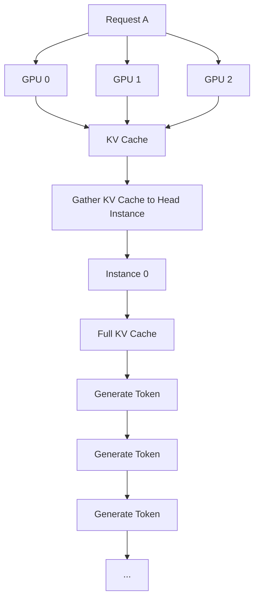

# OrionInfer: Low-Overhead Parallelism Switching and Live Migration for Efficient LLM Serving

## Metadata
- Paper: OrionInfer: Low-Overhead Parallelism Switching and Live Migration for Efficient LLM Serving
- Authors: Jingqi Feng, Guang Yang, Yukai Huang, Sicheng Liang, et al.
- Year: 2026
- Venue: KDD '26
- DOI: 10.1145/3770855.3817626
- Link: https://dl.acm.org/doi/epdf/10.1145/3770855.3817626
- Area: LLM serving, inference systems, parallelism switching, live migration
- Status: unread


## One-Sentence Summary
This paper presents an adaptive LLM serving systems that aligns inference strategies with real time demand. This is done through the following strategies:
1) Runtime switching between data parallelism and tensor parallelism with negligible overhead
2) An efficient inference pipeline that preserves batching efficiency during parallelism transitions
3) Live-migration based load balancing to alleviate memory pressure and imrpove resource utilization


## Problem
TP-priority setup suffers from hardware underutilization duringbursts, while a DP-priority setup fails to meet the latency require-ments of long-context requests. This rigidity in existing systemssuggests that a one-size-fits-all parallelism is inherently unable tomaintain optimal performance across fluctuating traffic patterns

## Core Idea and background
LLM inference consists of two phases:
1) Prefill phase, where it process the entire input prompt in parallel to generate the first token. This is measured by Time-To-First-Token (TTFT)
2) Decoding phase, subsequent tokens are generated one by one, generally memory bounded. Since each step only processes a single token per request, the hardware computational power is often underutilized. Performance is measured by Time-Per-Output-Token (TPOT) 
Works have been done in this space to improve inference optimization. One such example is to have parallelism strategies and dynamic adaptation. To handle large scale LLM serving capacity, systems use **static** (this paper aims to prove that a dynamic approach is better) Tensor Parallalism and Data Parallalism to improve serving capacity. Tensor Parallalism reduces latency for individual requests by **splitting large computations across multiple GPUs**. Data Parallalism maintains **higher preak throughput by processing multiple requests in parallel across different model replicas, making it more efficient for high traffic cases. 

## How It Works

1) Global Control Plane. 
    - Load Balancer: Distributes new requests. Employs a dual-mode distribution strategy based on real time memory pressure of the cluster. **Throughput Oriented Mode** is activated when the overall KV Cache utilization is low, to max throughput. **Memory Aware Mode** is triggered as KV Cache reaches a threshold. IT shifts to a memory aware strategy, routing requests to instances with the most available KV slots. This maintains service stability even when the cluster is near its memory limit. 
    - **Coordinator:** Tracks snapshots of all instances and makes high-level decisions, such as triggering parallelism hot switching or initiating live migration when a specific instance becomes overloaded. It dynamically chooses between two execution strategies:
    - **Low-Latency TP Mode:** Optimizes individual request latency. When traffic is low, multiple GPU instances cooperate on the **prefill of a single request** using Cross-Instance Tensor Parallelism (TP), reducing Time-To-First-Token (TTFT).
        - After prefill, the generated KV Cache is gathered to a **Head Instance**, which performs decoding independently.
    - **Throughput-Oriented DP Mode:** Optimizes system-wide throughput. When traffic is high, each GPU instance independently processes different requests, allowing more requests to be processed in parallel and clearing the queue faster.
    - **Key intuition:** Prefill is compute-bound, so combining the compute power of multiple GPUs using TP can significantly reduce TTFT. Decoding is more memory-bound and less compute-heavy, so it is generally not worth using multiple instances for one request.  
    - To switch between DP and TP has its challenges:

    1. **Synchronization Overhead**
        - To overcome this, OrionInfer creates a collective communication group among all local schedulers.
        - Local schedulers participate in a lightweight negotiation to decide whether to form a Cross-Instance TP batch based on the Coordinator's instructions.
        - Once a transition is triggered, the instances synchronize critical states, including available KV pages and request allocations, to ensure a consistent execution boundary for the Cross-Instance TP phase.

    2. **Weight Reconfiguration**
        - The weight layout required by **DP** and **TP** is different.
        - In **DP mode**, each GPU instance is an independent replica and initially holds a **complete copy of the model weights**.

        ```text
        DP MODE

        GPU 0                       GPU 1
        ┌─────────────────┐         ┌─────────────────┐
        │   Full Model    │         │   Full Model    │
        │    Weights      │         │    Weights      │
        └─────────────────┘         └─────────────────┘
                ↓                           ↓
            Request A                   Request B

        Each instance can independently process a different request.
        ```

        - In **TP mode**, multiple GPUs cooperate to process the **same request**. The model computation is partitioned across the TP workers.

        ```text
        TP MODE

                           Request A
                               ↓
                      Model Computation
                     /                 \
                    ↓                   ↓
                GPU 0                 GPU 1
           ┌──────────────┐      ┌──────────────┐
           │ Weight Shard │      │ Weight Shard │
           │      W0      │      │      W1      │
           └──────────────┘      └──────────────┘
                    \                   /
                     \                 /
                      ↓               ↓
                       TP Communication

        Multiple GPUs cooperate on the SAME request.
        ```

        - **Problem when switching DP → TP:** In DP, both GPUs contain the complete model, whereas TP requires each worker to operate on the weight shard associated with its TP rank.

        ```text
        BEFORE: DP

        GPU 0                    GPU 1
        [ Full Model W ]         [ Full Model W ]

                  ↓ Hot Switch: DP → TP ↓

        AFTER: TP

        GPU 0                    GPU 1
        [ Shard W0 ]  ← TP →    [ Shard W1 ]
                \                    /
                 \                  /
                    Same Request
        ```

        - Since every instance already contains a complete copy of the model, OrionInfer does not need to transfer the model weights between instances.
        - Instead, OrionInfer performs **virtual sharding** based on the worker's **flattened rank within the TP group**.
        - Intuition:
            - GPU 0 → TP rank 0 → use shard W0
            - GPU 1 → TP rank 1 → use shard W1
            - GPU 2 → TP rank 2 → use shard W2

    3. **KV Cache Layout Incompatibility**

        ```mermaid
        flowchart TD

        A[Request A]

        A --> G0[GPU 0]
        A --> G1[GPU 1]
        A --> G2[GPU 2]

        G0 --> KV[KV Cache]
        G1 --> KV
        G2 --> KV

        KV --> H[Gather KV Cache to Head Instance]

        H --> I[Instance 0]

        I --> F[Full KV Cache]
        F --> T1[Generate Token]
        T1 --> T2[Generate Token]
        T2 --> T3[Generate Token]
        T3 --> END[...]
        ```



    


2) Dynamic Execution Layer. 
    - Consists of multiple inference instances. Each instance includes a __Load Scheduler__ to manage its internal request queue and GPU workers for computation. 
    - Dynamic Cross instance TP Group. Instances connected by high bandwidth can be grouped via TP Communication to handle prefill tasks during low load. Instances can reschedulerequests via Asynchronous Decoupled Migration to resolve local bot-tlenecks without stopping the service
3) Orion Memory Server. 
    - Efficient KV Cache management
    - Orion Buffer: Designed to overlap prefill computation with the KV Cache gathering pro-cess within Cross-Instance TP Groups. It stores metadata, suchas KV Cache pointers and slot mappings, and serves as a tempo-rary staging area for the KV tensors generated during the prefillphase.
    - Delegated KV Cache Manager: This manager cooperateswith the Orion Buffer to facilitate asynchronous data movement.It is responsible for orchestrating the transfer of KV tensors fromthe Orion Buffer into the distributed KV Cache of individual GPUworkers.
    - Shared Memory Pool: facilitate asynchronous decoupledmigration, the Shared KV Memory Pool serves as a staging layerthat decouples state synchronization from the execution criticalpath.


## Key Concepts I Met
- LLM serving:
- Data parallelism:
- Tensor parallelism:
- Live migration:
- KV cache:

## Things I Had To Look Up
- 

## Important Details


## What I Learned


## Confusing Parts


## Follow-Up
- Concepts to study:
- Related papers:
- Possible experiments:
