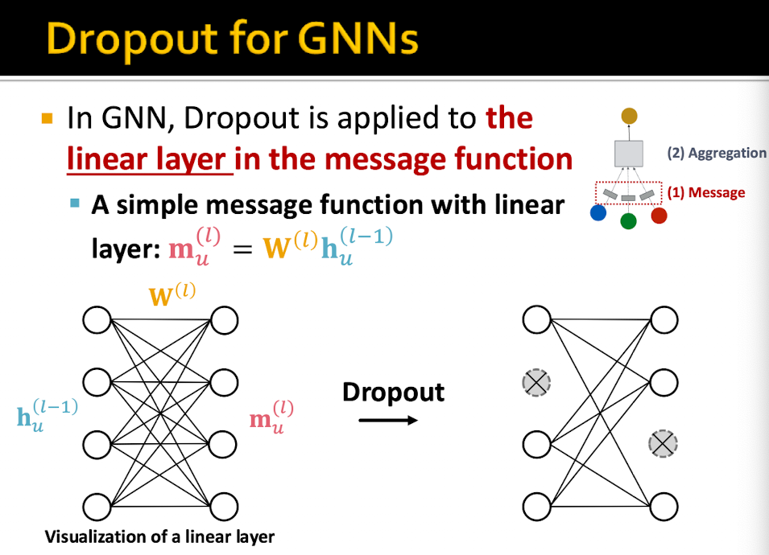
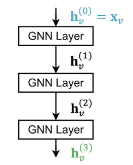
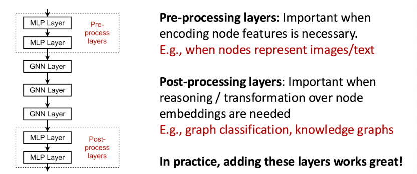
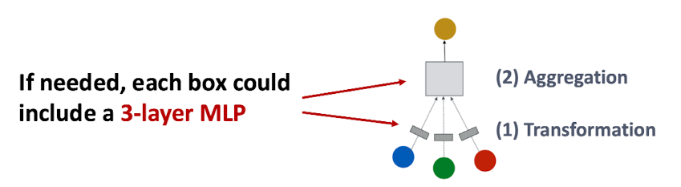
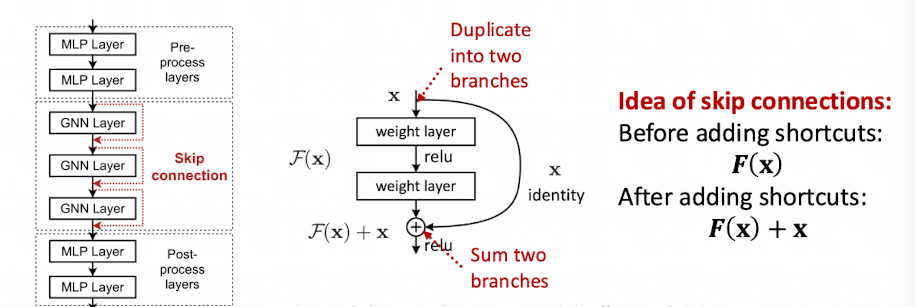
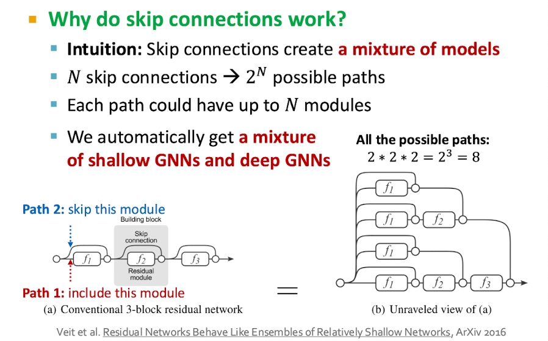

### Graph Convolutional Network (GCN)

### GraphSAGE

### Graph Attention Networks

- **Idea:** Compute the embedding $h_v^{(l)}$ of each node using an **attention strategy**.

    - Nodes attend over their neighbors' messages.
    - Different neighbors can be assigned different levels of importance.

- Compute an **attention coefficient** $e_{vu}$ for each pair of connected nodes $v,u$.

    - $e_{vu}$ represents the importance of node $u$'s message to node $v$.
    - The attention coefficient is computed using an attention function $a$:

```math
e_{vu} = a(m_u^{(l)}, m_v^{(l)})
```

- Normalize the attention coefficients using **softmax** to obtain the final attention weights $\alpha_{vu}$.

```math
\alpha_{vu}
=
\frac{\exp(e_{vu})}
{\sum_{k \in N(v)} \exp(e_{vk})}
```

The attention weights over all neighbors of $v$ sum to 1.

- Use the attention weights to perform a **weighted aggregation** of the neighbors' messages:

```math
h_v^{(l)}
=
\sigma\left(
\sum_{u \in N(v)}
\alpha_{vu} W^{(l)}h_u^{(l-1)}
\right)
```

- The **attention function** $a$ can be implemented as a small neural network.

    - The parameters of $a$ are learned during training.
    - This allows the model to learn which neighbors are more important to a particular node.

- **Multi-head attention** can be used to stabilize training.

    - Multiple attention mechanisms are learned with different parameters.
    - Each attention head produces its own node vector.
    - The outputs of the different heads are combined using concatenation or summation.
[insert attention mech 1 to 4]  

### GNN Layer in practice
[insert gnn layer in practice img]

#### What is Batch normalization
To stablise NN training
Given a batch of node embeddings we want to
1) Re-center the node embeddings into zero mean. We compute the mean and variance over N embeddings
2) Re-scale the variance into unit variance. Normalize the features using computed mean and variance

```math
\mu_j = \frac{1}{N}\sum_{i=1}^{N} X_{i,j}
```

```math
\sigma_j^2 = \frac{1}{N}\sum_{i=1}^{N}(X_{i,j} - \mu_j)^2
```

```math
\hat{X}_{i,j} = \frac{X_{i,j} - \mu_j}{\sqrt{\sigma_j^2 + \epsilon}}
```

```math
Y_{i,j} = \gamma_j \hat{X}_{i,j} + \beta_j
```

#### What is Dropout and how is it different for GNNs
Dropout layer is to prevent a Neural Net from overfitting
During training: with some probability p, randomly set neurons to zero (turn off)
During testing: Use all neuraons for computation




### Concerns over stacking GNN layers
We usually stack GN layers sequentially

However, GNN suffers from **Over smoothing**. This means that all the node embeddings converge to the same value. Ideally we want node embeddings to differenciate nodes.  
We first have to understand the idea of receptive fields of a GNN

We know the embedding of a node is determined by its **receptive field**, if two nodes have higly overlaped receptive fields, then their embeddings are highly similiar. If we stack many GNN layers, nodes will have highly overlapped receptive fields, node embeddings will be highly similar and thus suffer from the over smoothing problem.   
**Adding more GNN layers do not always help** 

#### How do we overcome over-smoothing

1) We make a shallow GNN more expressive. 
    - Add layers that do not pass messages. Add MLP layers before and after GNN layers, as **Pre processing layers*** and **Post Processing layers** 
    
2) Increase the expressive power within each GNN layers. 
    - We can make aggregation become a DNN
     
3) Add skip connections if you need many layers of GNN
    - 
    - 