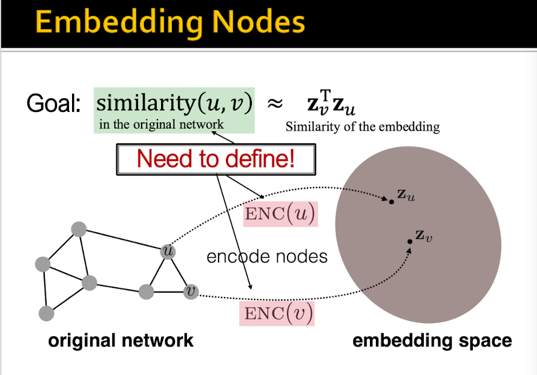
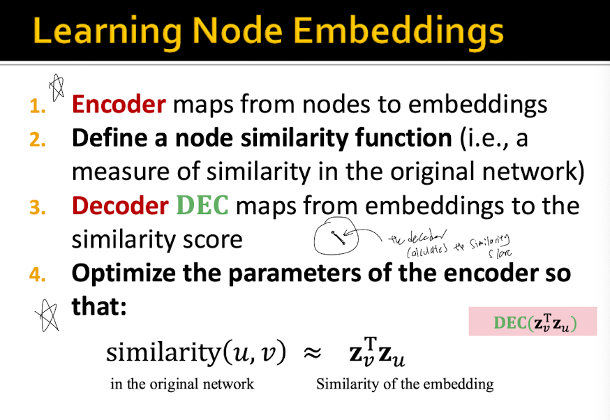
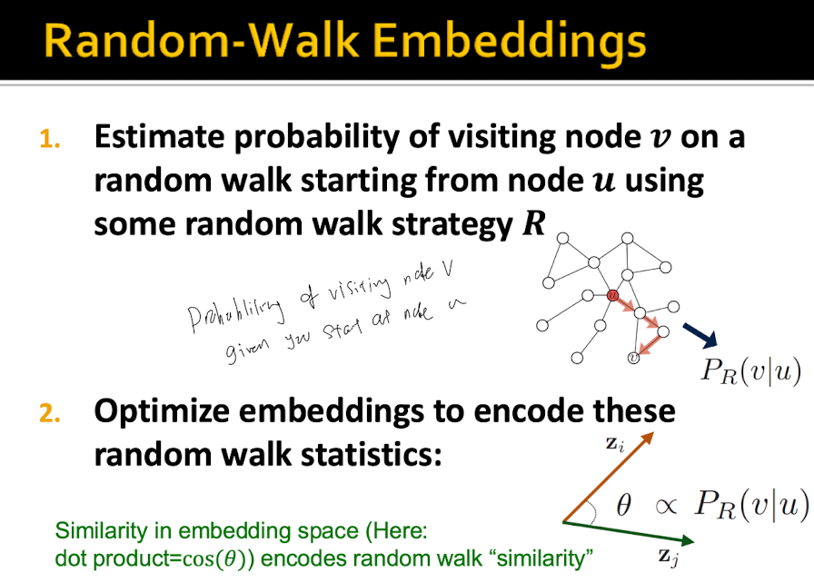
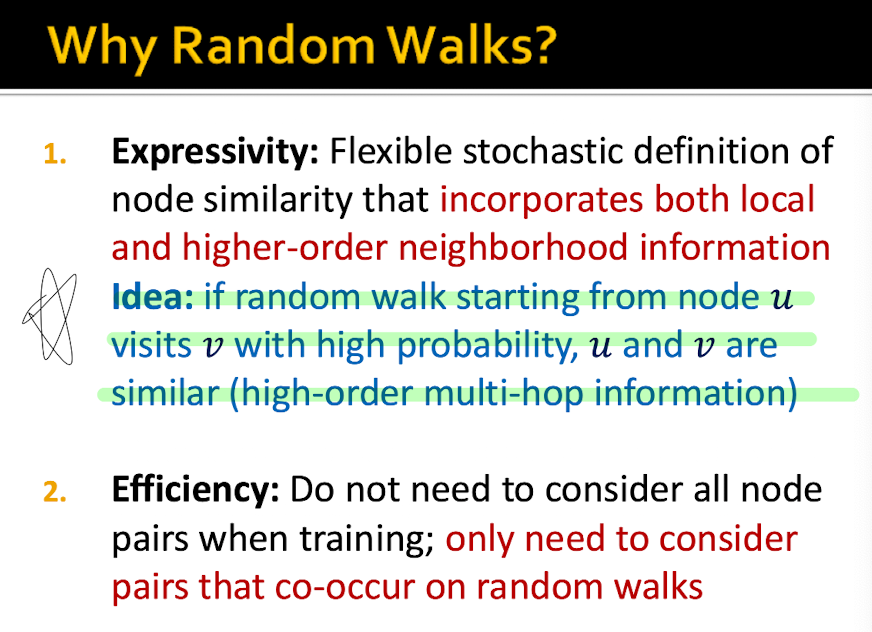
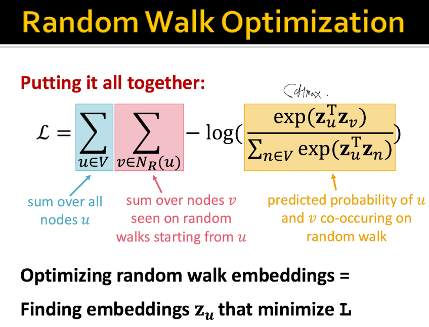
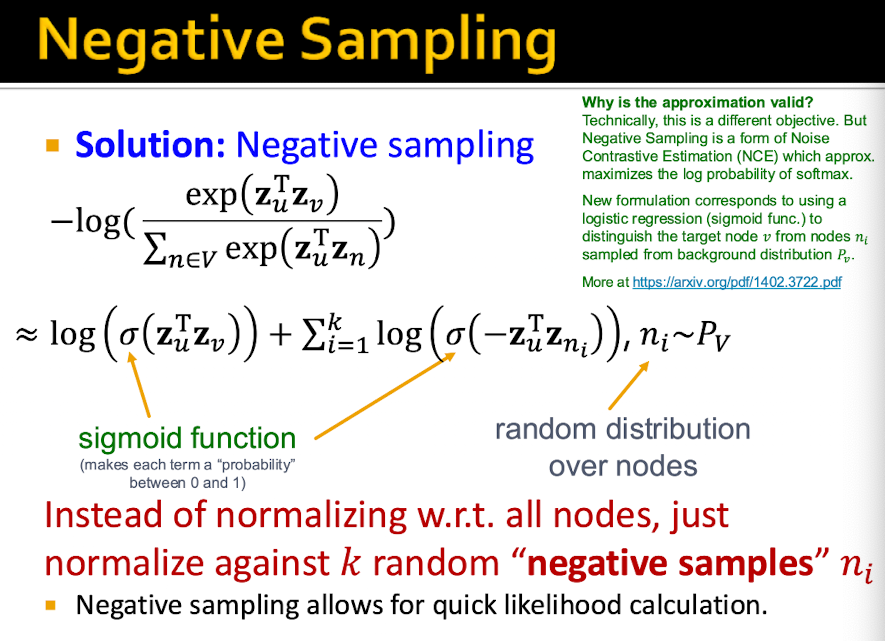
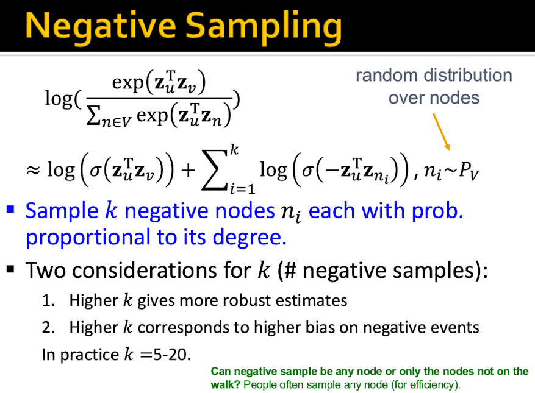
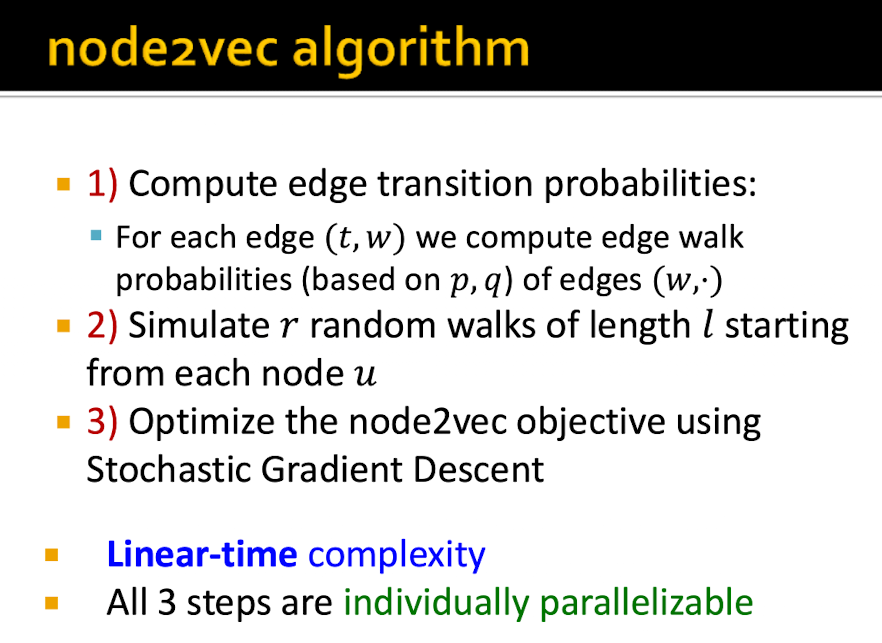
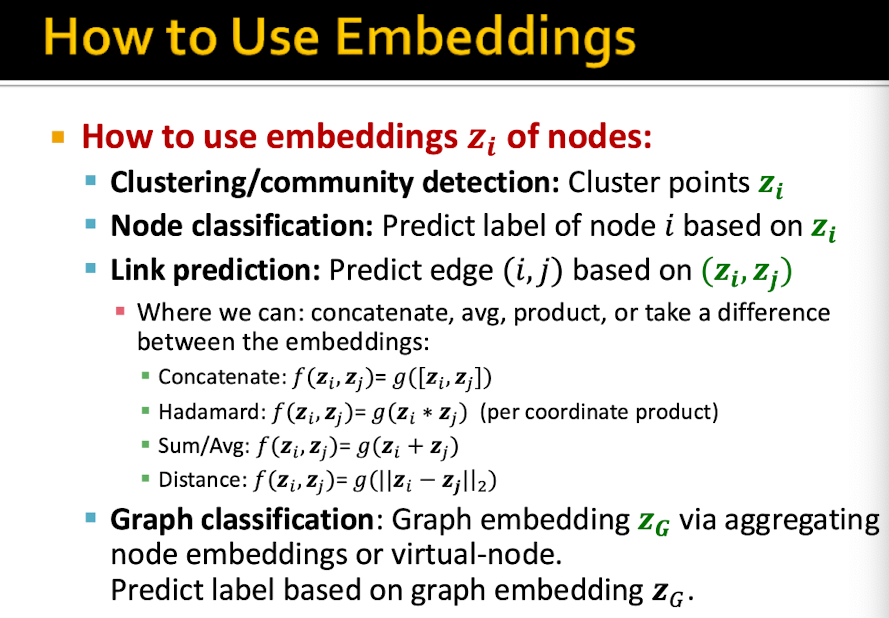

# Node Embeddings

## Questions

### Why do we want to learn node embeddings instead of hand-engineering graph features every time?

We want to learn node embeddings because hand-engineering graph features is difficult, slow, and task-specific. Instead of manually deciding which graph properties matter, the model learns vector representations of nodes directly from the graph structure.

### What does it mean to map a node into a vector space?

It means representing each node as a vector of numbers. Nodes that are similar in the graph should be close together in this vector space, while nodes that are different should be farther apart.

### What should a good node embedding preserve about the original graph?
- The goal is to encode nodes so that similarity in the embedding space approximates similarity in the graph

### What is the encoder-decoder framework for learning node embeddings?
- The encoder maps from nodes to embeddings
- The Decoder maps from embeddings to the similarity score
- We need to optimize the parameters of the encoder such that Similarity(u,v) = Similarity of the embeddings in the embedding space

### Why is the definition of node similarity important?
- This is crucial because there are various ways to define node similarity which gives us the direction of how to optimise the encoder.
- Node similarity can be defined as follows:
    - are they linked?
    - do they share neighbours
    - do they have similar structural roles

## Shallow Node Embeddings

### What is a shallow node embedding?

A **shallow node embedding** directly learns one embedding vector $z_v$ for every node $v$ in the graph.

For example, suppose we have four nodes:

$$
V = \{A, B, C, D\}
$$

Each node has its own embedding:

$$
A \rightarrow z_A,\qquad
B \rightarrow z_B,\qquad
C \rightarrow z_C,\qquad
D \rightarrow z_D
$$

These embeddings can be stored together in an embedding matrix:

$$
Z =
\begin{bmatrix}
0.2 & 0.7 \\
0.8 & 0.1 \\
0.4 & 0.9 \\
0.6 & 0.3
\end{bmatrix}
$$

where each row corresponds to one node:

$$
Z =
\begin{bmatrix}
z_A \\
z_B \\
z_C \\
z_D
\end{bmatrix}
$$

For example:

$$
z_A = [0.2, 0.7], \qquad
z_B = [0.8, 0.1]
$$

The important idea is that the embedding is **directly learned**. There is no neural network computing $z_A$ from the features or neighbours of node $A$.

---

### Why can a shallow encoder be viewed as an embedding lookup table?

A shallow encoder can be viewed as an **embedding lookup table** because encoding a node simply means retrieving its corresponding row from the embedding matrix $Z$.

At first, the embedding table contains randomly initialized vectors, so there is nothing meaningful to look up yet. The encoder still performs a lookup because each node ID is assigned a row in the table. Training updates these vectors so that the lookup becomes meaningful.

For example:

| Node | Learned embedding |
| --- | --- |
| A | $[0.2, 0.7]$ |
| B | $[0.8, 0.1]$ |
| C | $[0.4, 0.9]$ |
| D | $[0.6, 0.3]$ |

If the input is node $B$, then:

$$
ENC(B) = z_B
$$

so we simply retrieve:

$$
ENC(B) = [0.8, 0.1]
$$

Therefore, a shallow encoder is essentially:

$$
\boxed{\text{Node ID} \rightarrow \text{stored learned vector}}
$$

It does **not** compute the embedding from the node's features or neighbourhood.

---

### What are the learnable parameters in a shallow embedding method?

The learnable parameters are the **node embeddings themselves**.

They are stored inside the embedding matrix:

$$
Z \in \mathbb{R}^{|V| \times d}
$$

where:

- $|V|$ = number of nodes
- $d$ = embedding dimension

For example, if there are 4 nodes and each embedding has dimension 2:

$$
Z \in \mathbb{R}^{4 \times 2}
$$

and:

$$
Z =
\begin{bmatrix}
0.2 & 0.7 \\
0.8 & 0.1 \\
0.4 & 0.9 \\
0.6 & 0.3
\end{bmatrix}
$$

All 8 numbers in this matrix are **learnable parameters** that are updated during training.

Therefore:

$$
\boxed{\text{Shallow embedding: learn } Z \text{ directly}}
$$

This is different from a GNN.

A shallow embedding learns a separate vector for each node:

$$
\boxed{\text{Node ID} \rightarrow z_v}
$$

A GNN instead learns a function that computes the node embedding using the node's features and graph neighbourhood:

$$
\boxed{\text{Node features + neighbourhood} \rightarrow z_v}
$$

This distinction is important because a shallow encoder stores embeddings for the nodes it knows, whereas a GNN learns how to **produce** embeddings from graph information.  

### Random Walk Approaches for Node embeddings

- Intuition: By using random walks from node u to node v, let's say if by random walks node v is commonly reached when starting from node u, then node u and v must be neighbours
- This is also efficient as we do not need to consider all node pairs when training, only need to consider pairs that co-occur on random walks

### How can we optimize random walk?

- Run short fixed length random walks starting from each node u in the graph using some walk strategy R (BFS/DFS etc.)
- For each node u collect Nr(u), the multiset of nodes visited on random walks starting from u
- Optimize the objective function

- However this is too costly O(V)^2 as nested sum over nodes
This brings us to the next point of negative sampling

### Random Walk Summary

- Run short fixed-length random walks starting from each node on the graph.
- For each node $u$, collect $N_R(u)$, the multiset of nodes visited on random walks starting from $u$.
- Optimize the embeddings $Z$ using SGD with the following loss function:

$$
\mathcal{L}
=
\sum_{u \in V}
\sum_{v \in N_R(u)}
-\log P(v \mid z_u)
$$
- We can efficiently approximate this loss function using negative sampling.
$$
\boxed{\text{Random Walks}}
\rightarrow
\boxed{\text{Collect } N_R(u)}
\rightarrow
\boxed{\text{Initialize Embeddings } Z}
\rightarrow
\boxed{\text{Optimize Embeddings } Z}
$$

### What is node2vec trying to improve over a basic random walk?
- We make the walk flexible instead of random. We can use DFS/BFS to get local/global views of the network
- BFS-like exploration stays close to the starting node, so it captures local neighbourhood similarity.
- DFS-like exploration moves farther away, so it captures nodes that may have similar structural roles even if they are not close together.

### Overview of node2vec algorithm and its parameters

node2vec follows three main steps:

1. **Compute transition probabilities:** Use $p$ and $q$ to determine the probability of moving along each edge.
   - $p$ controls how likely the walk is to **return to the previous node**.
   - $q$ controls whether the walk prefers **staying nearby or exploring farther away**.

2. **Run random walks:** From each node $u$, simulate $r$ random walks, each of length $l$. These walks determine the random-walk neighbourhood $N_R(u)$.

3. **Learn the embeddings:** Use the nodes encountered during the walks as training targets and optimize the node embeddings $Z$ using SGD.

Therefore, the overall pipeline is:

$$
\boxed{\text{Compute probabilities using }p,q}
\rightarrow
\boxed{\text{Run random walks}}
\rightarrow
\boxed{\text{Optimize embeddings }Z}
$$

### Approaches to embed entire graphs
1) Run a standard graph embedding technique on graph , Then just sum (or avg) the node embeddings in the graph G
2) Introduce a 'super node' to represent the graph and run a standard graph embedding technique to embed that node

### Use cases for embeddings

